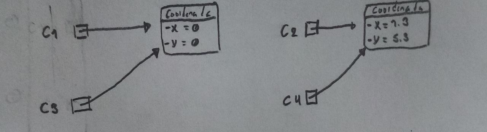
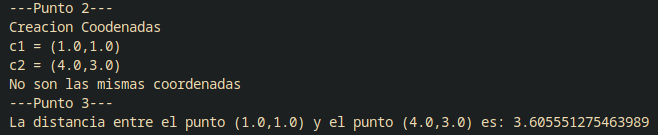

# Quiz Coordenadas

## Diagrama de objetos


## Modelo

```java
package modelo;

public class Coordenada 
{
    private double x;
    private double y;

    public Coordenada()
    {

    }

    public Coordenada(double x, double y)
    {
        this.x = x;
        this.y = y;
    }

    public double getX() 
    {
        return x;
    }

    public void setX(double x) 
    {
        this.x = x;
    }

    public double getY() {
        return y;
    }

    public void setY(double y) 
    {
        this.y = y;
    }

    public double getDistancia(Coordenada cord)
    {
        double distancia = Math.sqrt(Math.pow(cord.getX() - x, 2) + Math.pow(cord.getY() - y, 2));

        return distancia;
    }

    @Override
    public String toString() 
    {
        return "(" + x+"," + y + ")";
    }

    @Override
    public boolean equals(Object obj) 
    {
        Coordenada cord = (Coordenada)obj;
        return x == cord.getX() && y == cord.getY();

    }

}
```

## Main
```Java
public static void main(String[] args) {
        //Punto 2
        System.out.println("---Punto 2---");
        System.out.println("Creacion Coodenadas");
        Coordenada c1 = new Coordenada(1, 1);
        Coordenada c2 = new Coordenada(4, 3);
        System.out.println("c1 = " + c1);
        System.out.println("c2 = " + c2);

        if(c1.equals(c2))
        {
            System.out.println("Son las mismas coordenadas");
        }
        else
        {
            System.out.println("No son las mismas coordenadas");
        }

        //Punto 3
        System.out.println("---Punto 3---");
        System.out.println("La distancia entre el punto " + c1 + " y el punto " + c2 + " es: " + c1.getDistancia(c2));
        System.out.println();
    }
```

## Resultado
